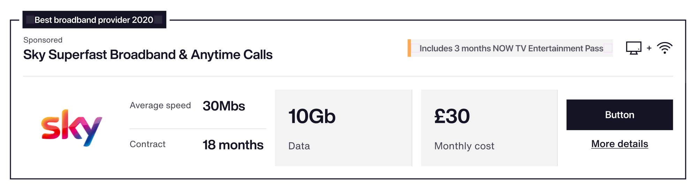
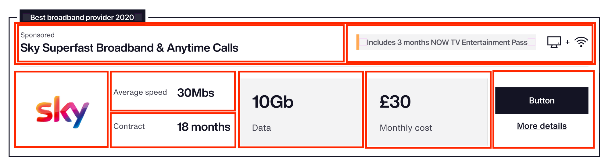
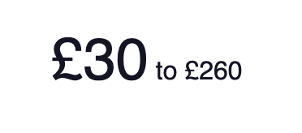

# Rate Tables

The rate tables package contains a bunch of components that can be used to
build a row of a rate table, like this:



The component is extremely generic and can power different looking rate tables
while still maintaining visual consistency between them. For example:

- There can be a subtitle below the title instead of a leader above
- The content to the right of the title is completely customisable - and can
  appear mixed in with the other content on mobile
- The entire grid area is completely customisable - cells can be swapped out
  for other cells, the number of columns can be changed, they can appear in a
  different order on mobile
- Cells can appear in a different place on mobile: for example, the sky logo
  could appear to the left of the title on smaller displays
- Completely custom HTML can be passed in - cells don't all have to be powered
  by components from this package
- Additional content can be added anywhere in the row using "addons" - for
  example, a footer

Basically, this package provides a framework to creating rate tables without
being too prescriptive about what they should look like—but in a way that still
maintains visual consistency throughout a brand.

This is conceptual documentation, not API documentation - look at storybook if
you want to know how to actually use it.

## tl;dr

- A rate table row consists of a **body**, a **header** and a **grid** (the
  latter two of which are contained in the body).
- You can use **cells**, of which there are some already provided, to populate
  the row.
- Cells can be provided either as children, in which case they'll automatically
  be laid out in the grid, or as **addons**.
- There are two built in addons, **footer** and **responsive**.
- You can create both your own cells and addons!
- There are built in data formatters, designed purely for consistency between
  usages.

## Structure and terminology



A rate table row is a collection of **cells**, inside **sections** of the row.

There are three main sections:

- The **body**, which is the entire row. This is laid out with CSS grid.
- The **header**, which is the top section with the titles and "Includes 3
  months" call out in the screenshot above. This is both a cell itself -
  positioned within the body grid - and contains cells - positioned using
  flexbox.
- The **grid**, which is the main content below the header. This doesn't have
  its own element in the DOM - it is positioned in the body section's grid.

These sections will be especially important to know when writing addons.

There are two ways to add cells to the body of a rate table row: as children
(where they are added to the grid) and as addons (where the positioning is a
bit more configurable). In the grid the cell components and the order they're
specified in is responsible for layout, while with addons you get full control
over where they are displayed.

- As children, they're added to the grid section and the cell components and
  order they're specified in is responsible for their layout.
- As **addons**, you get full control over where they're displayed _outside_ of
  the grid, but less control of where it displays inside the grid.

## Cells

These examples cover cells inside the grid, but all of these cells can be used
in addons - that'll be covered in the next section.

There's a number of already written cell types, such as:

- The base cell, which doesn't format its content as all
- An image cell, which is good for displaying e.g. logos and product pictures
- The split cell, which can be passed multiple cells to display in the space of
  one cell (more on this below)
- The CTA cell, which contains call to action link buttons

This isn't a complete list, and you also don't have to use them - you can pass
you own cells in.

As this is conceptual documentation, not API documentation, see storybook and
stories.tsx to see all the cells and how to use them.

### The base cell

Nearly all of the built in cells use the base cell internally - this one is
pretty important. It handles the layout within the grid, the padding / margin
around it, and the borders between the cells if necessary.

It's recommended that if you use your own cells, you use this one as a wrapper.
The only common exception to this is when you want to modify the layout - but
it's likely you'd want to be using the split cell for most changes anyway.

### The split cell

The split cell is what powers the "Average speed" and "Contract" section in the
screenshot at the start of this document. In JSX, that would actually look
something like this:

```js
<RateTable.cells.Split>
  <RateTable.cells.Content label="Average speed">
    30Mbps
  </RateTable.cells.Content>
  <RateTable.cells.Content label="Contract">18 months</RateTable.cells.Content>
</RateTable.cells.Split>
```

It takes other cells as arguments, then lays them out within the space of a
cell as rows. On mobile, it's effectively ignored and the cells display below
each other as if they were two cells.

The split cell doesn't actually output anything to the DOM itself.

When inside a cell, you can tell whether you're inside a split cell or not
using `CellContext`:

```js
import { CellContext } from './generics'

// ...

const { inSplit } = React.useContext(CellContext)
```

### Writing your own cell

In addition to the cells available under `RateTable.cells`, you can also create
your own cells types when the existing ones don't do what you need.

Usually, it's best to extend the content cell or the base cell. The content
cell displays a label (except in addons on desktop) and your specified content,
and the base cell is just a blank canvas.

For example, in FS we need an eligibility status showing using a progress bar.
This isn't needed by any other teams and is quite simple, so it isn't part of
the rate table package.

We can extend the content cell to do this:

```typescript jsx
const EligibilityCell: React.FC<EligibilityCellProps> = ({ percent }) => (
  <RateTable.cells.Content label="Eligibility" mobileOrder={1}>
    <div
      sx={{
        textAlign: 'center',
        maxWidth: 300,
        minWidth: [0, 200],
        marginLeft: 'auto'
      }}
    >
      <span sx={{ display: 'block', fontSize: 14, marginBottom: 'xs' }}>
        <strong>{percent}%</strong> chance of approval
      </span>
      <ProgressBar current={percent} max={100} />
    </div>
  </RateTable.cells.Content>
)
```

Then, you can use in a row like any other cell:

```js
<RateTable.Row {...otherProps}>
  {/* ... */}
  <EligibilityCell percent={80} />
  {/* ... */}
</RateTable.Row>
```

It will be automatically laid out in the grid.

## Addons

If you want content to appear _outside_ of the grid, you'll need to use an
addon. There's a couple built in ones that cover pretty much every use case, or
you can build your own.

### The footer addon

The footer addon is pretty simple to use: provide it with a cell, and it's
displayed at the bottom of the row, full width, with a border above it:

```jsx harmony
addons={
  [
    { 
      addon: RateTable.addons.footer,
      component: (
        <RateTable.cells.Base sx={{ display: 'block' }} mobileOrder={100}>
          <small sx={{ fontSize: 'xs' }}>
            Representative example: Assumed borrowing of £10,000 over...
          </small>
        </RateTable.cells.Base>
      )
    }
  ]
}
```

Internally, the footer addon inserts this into the body section of the row.

### The responsive addon

Let's take the eligibility example from above: on desktop, we want it to
display to the right of the title, and on mobile, we want it to display mixed
in with the grid cells.

For this, we can use the responsive addon. This addon allows us to insert our
content into different places in the row, and change where it is displayed on
different viewports.

This is how we can do that:

```jsx harmony
{
  addon: RateTable.addons.responsive,
  component: <EligibilityCell percent={80} />,
  options: {
    positions: ['body', 'header']
  }
}
```

The `positions` array uses the breakpoints from the breakpoints in the theme and
accepts the values `header`, `grid` and `body`.

### Building your own addon

Needs documenting.

## Data formatters

Data formatters are simple components designed to output formatted data (duh).

For example, the range data formatter takes a `from` value and a `to` value and
displays something like this:



These are great for using inside content cells, and I'd recommend that if none
of the existing data formatters suit your need, you add a new one and contribute
it back to the package.

When there's more than one, it would be good to get them all in storybook (and
this paragraph removed!)
